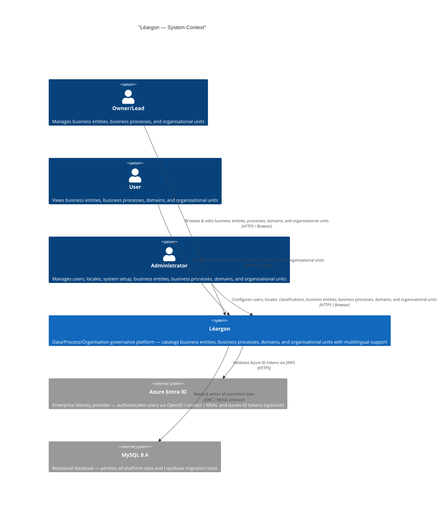
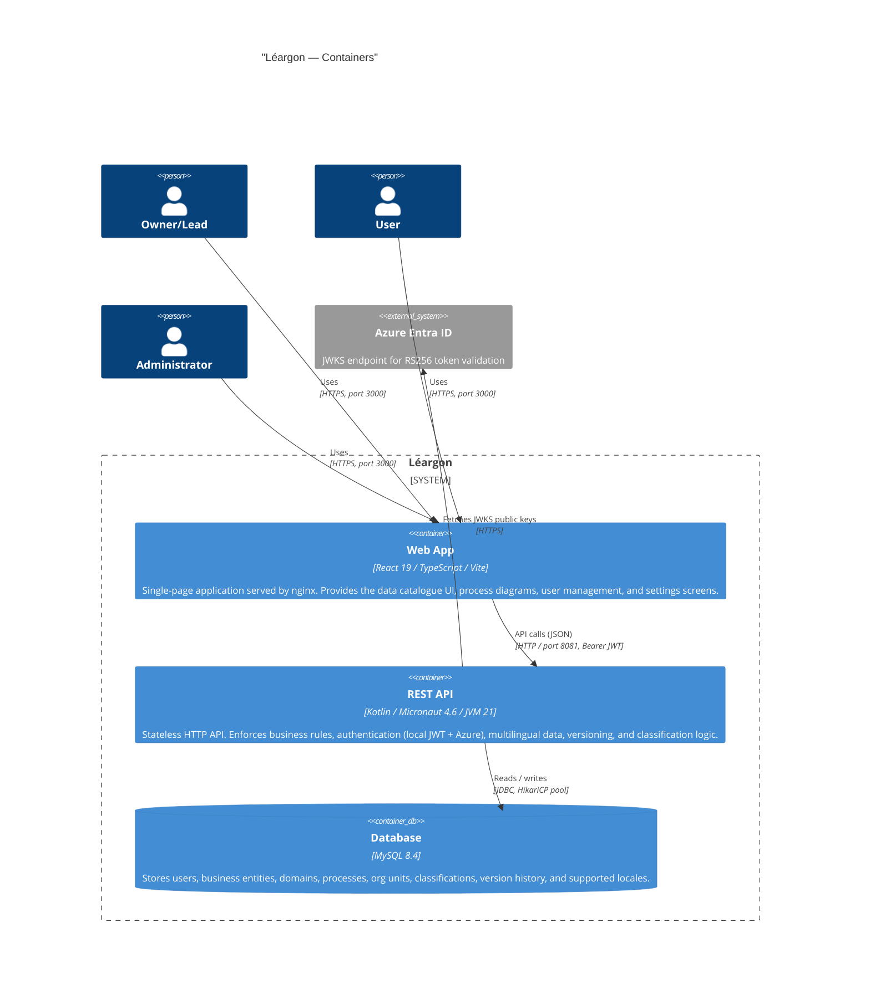
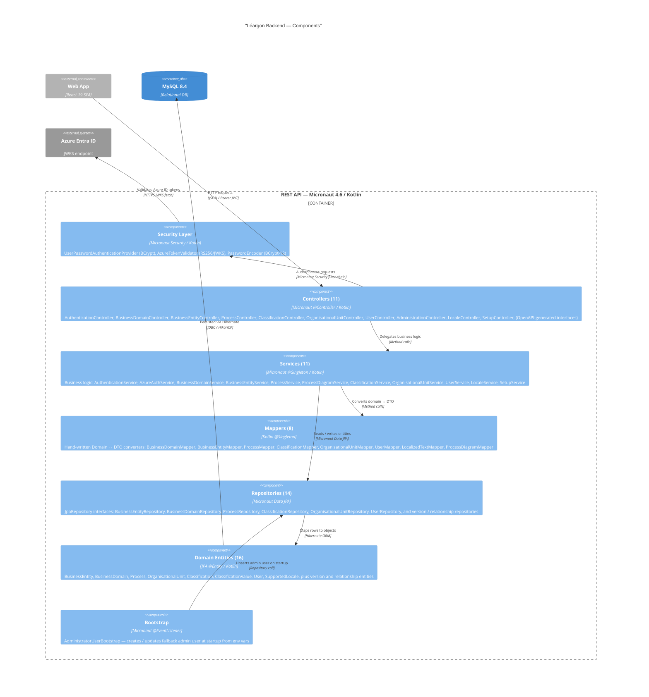
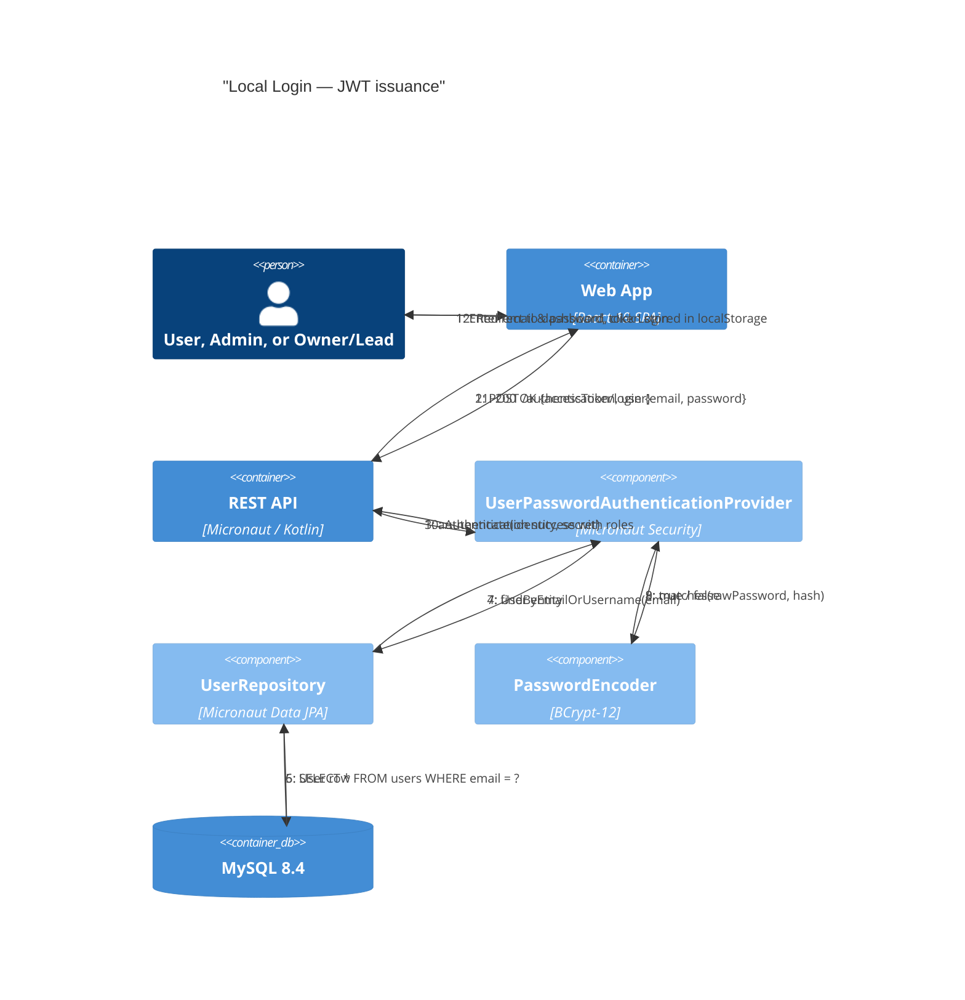
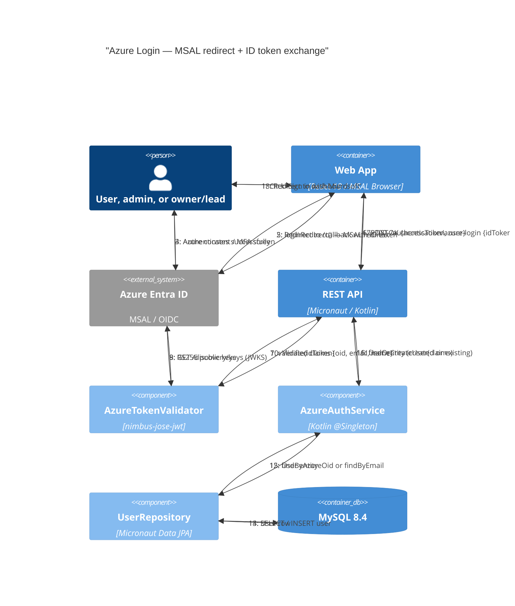
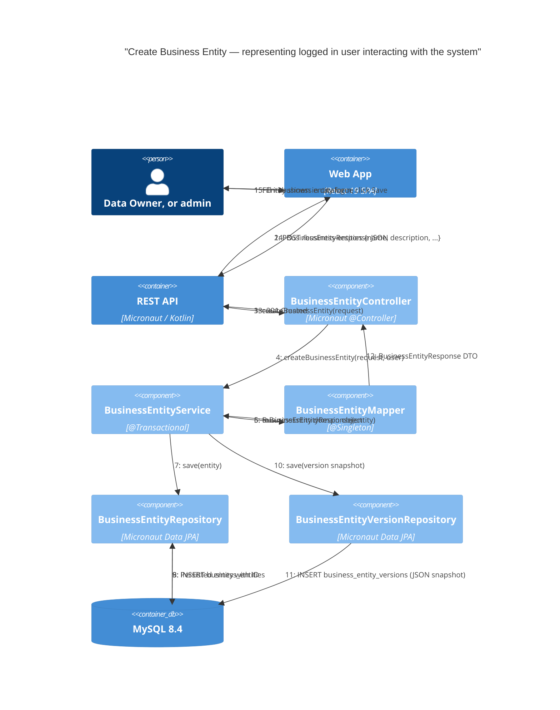
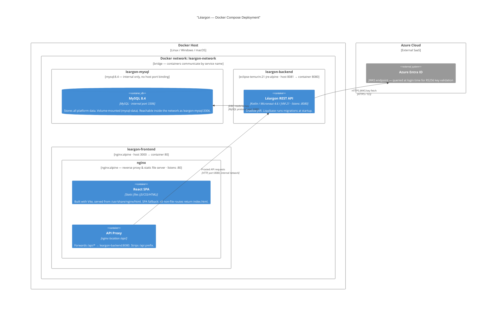

# Léargon — C4 Architecture Diagrams

> Rendered with [Mermaid](https://mermaid.js.org/) C4 support.

---

## 1. System Context (C4Context)

Who uses Léargon and what external systems does it interact with?

---

## 2. Container Diagram (C4Container)

What deployable units make up the system?

---

## 3. Component Diagram (C4Component)

What are the major components inside the backend API?

---

## 4. Dynamic Diagrams (C4Dynamic)

### 4a. Local Login Flow

### 4b. Azure Entra ID Login Flow

### 4c. Create Business Entity Flow

---

## 5. Deployment Diagram (C4Deployment)

How is Léargon deployed with Docker Compose?

### nginx configuration summary (`nginx.conf.template`)

| **Concern**              | **Detail**                                                                                                                                                       |
|--------------------------|------------------------------------------------------------------------------------------------------------------------------------------------------------------|
| **API proxy**            | `location /api/` → `proxy_pass ${BACKEND_URL}/` — strips `/api` prefix before forwarding                                                                         |
| **SPA routing**          | `location /` → `try_files $uri $uri/ /index.html` — all unknown paths serve the React app                                                                        |
| **Static asset caching** | `*.js, *.css, *.png, ...` → `Cache-Control: public, max-age=31536000, immutable` (1 year)                                                                        |
| **Gzip**                 | Enabled for text, CSS, JS, JSON, XML                                                                                                                             |
| **Security headers**     | `X-Frame-Options: DENY`, `X-Content-Type-Options: nosniff`, `X-XSS-Protection`, `HSTS`, `Referrer-Policy: strict-origin-when-cross-origin`, `Permissions-Policy` |
| **CSP**                  | `default-src 'self'`; allows `connect-src` to `login.microsoftonline.com` and `sts.windows.net` for MSAL                                                         |
