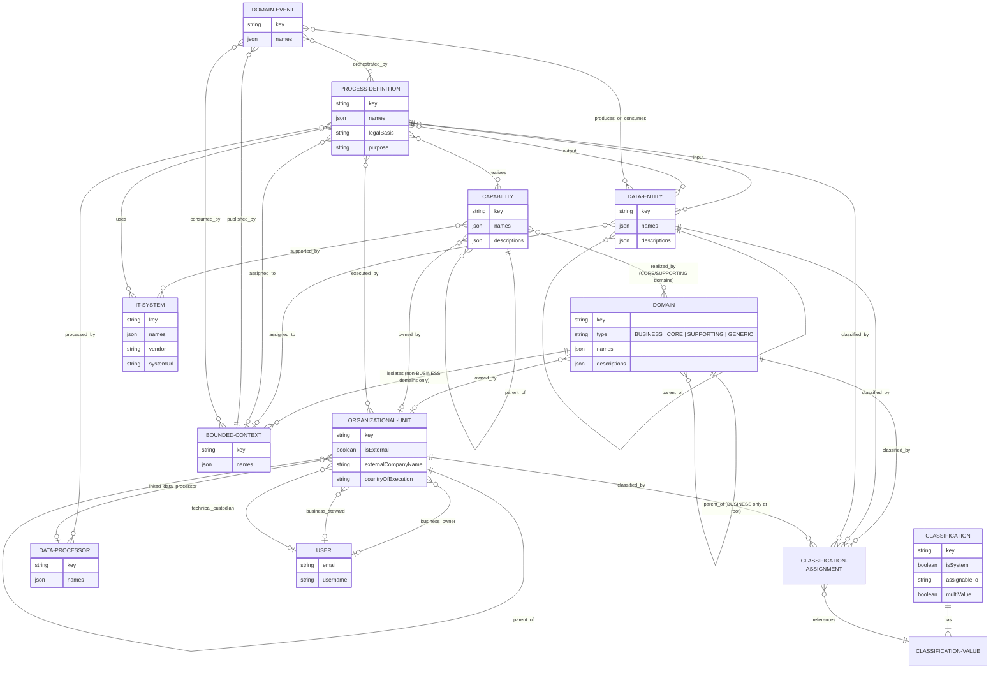

# Leargon — Core Concepts

## 1. Three Frameworks, One Model

Leargon unifies three distinct analytical frameworks inside a single data model. Each framework asks a different question about the organisation, yet they share the same underlying objects — domains, processes, entities, and teams — just viewed through a different lens.

### Domain-Driven Design (DDD)

DDD partitions an organisation's knowledge into **Bounded Contexts**: explicit boundaries inside which a consistent vocabulary (the *ubiquitous language*) is agreed and enforced. In Leargon, every Business Domain that is not a pure *Business* domain (i.e. a core, supporting, or generic domain in BCM terms) can contain one or more Bounded Contexts. Data entities and processes are assigned to a Bounded Context, which gives them their canonical meaning. Domain Events record what happened inside a context and flow to other contexts through explicit publish/consume relationships, making the Context Map machine-readable. Context relationships (Partnership, Customer–Supplier, ACL, Conformist, etc.) document the strategic coupling between teams.

### Business Capability Modelling (BCM)

BCM asks: *what must the organisation be able to do, independent of how it is structured today?* A **Capability** is a stable, named ability — "Customer Onboarding", "Order Fulfilment" — that does not change when teams reorganise. Capabilities form a tree. Processes *realise* capabilities (one process can contribute to many capabilities). IT systems *support* capabilities. Org units *own* capabilities. Leargon computes downstream views: a capability's data scope (all entities touched by its processes), its owning teams, and the IT systems it depends on.

### DSG/GDPR Compliance

Swiss revDSG and EU GDPR impose obligations at the process level: every data-processing activity must declare a legal basis, a purpose, and technical/organisational measures. Sensitive entity categories (e.g. health data) must be identified. Data processors and cross-border transfers must be registered. DPIAs must be triggered for high-risk processing. Leargon models these requirements as first-class fields on processes and entities, and uses the **system classifications** (seeded at startup and locked from modification) to tag entities with `personal-data`, `special-categories`, and similar attributes. The Processing Register page directly renders Art. 30 GDPR / Art. 12 revDSG-required information.

### How They Interweave

The three frameworks share structural objects but use them for different purposes:

| Object | DDD role | BCM role | DSG/GDPR role |
|---|---|---|---|
| Bounded Context | Linguistic boundary, context map node | Unit of ownership | Processing scope |
| Process | Event producer/consumer | Capability realisation | Processing activity (Art. 30) |
| Data Entity | Ubiquitous Language noun | Capability data scope | Personal data category |
| Org Unit | Team owning a context | Capability owner | Data controller / processor |
| Classification | Domain tag | Maturity/criticality tag | Personal data / legal basis flag |

A process classified as `personal-data = personal-data--contains` is simultaneously a DDD *verb* (something that happens in a context), a BCM realisation (it fulfils a capability), and a GDPR processing activity that must appear in the register.

---

## 2. Logical Entity-Relationship Diagram

---

## 3. Computed vs Explicit Relationships

### Explicit (stored in the database)

| Relationship | Where stored |
|---|---|
| Process → Capability | `process_capability` join table |
| Domain → Bounded Context | `bounded_context.domain_id` FK |
| Domain Event → Data Entity (PRODUCES / CONSUMES) | `domain_event_entity` join table with link type |
| Data Entity → Bounded Context | `business_entity.bounded_context_id` FK |
| Process → Data Entity (input / output) | `process_input_entity` / `process_output_entity` join tables |
| Org Unit → Data Processor | `organisational_unit.linked_data_processor_id` FK |
| Context → Context relationship | `bounded_context_relationship` table |

### Computed (derived at query time or in the frontend)

| Derived view | How derived |
|---|---|
| Capability's data entities | Union of all input/output entities across all processes that realise the capability |
| Capability's org units | Union of all executing units across all processes that realise the capability |
| IT system's data entities | Union of input/output entities of all processes that use the IT system |
| IT system's org units | Union of executing units of all processes that use the IT system |
| "Handles personal data" on process | Process has a `personal-data = personal-data--contains` classification assignment |
| Ubiquitous Language per Bounded Context | All entities assigned to that context (nouns), all processes assigned (verbs), all events published or consumed (events) |
| Processing Register completeness | Ratio of filled mandatory fields vs total mandatory fields per process |
| Conway's Law misalignment | Processes where the executing org unit's bounded context differs from the process's bounded context |

---

## 4. Analytical Perspectives

### DSG/GDPR Perspective

Focuses on accountability and compliance evidence:

- **Personal data classification** — which entities carry personal data or special categories (via system classifications)
- **Legal basis per process** — Consent, Contract, Legal Obligation, Vital Interest, Public Task, Legitimate Interest
- **Purpose per process** — free-text description of the processing purpose
- **DPIA** — triggered on high-risk processes; tracks risk description, mitigation measures, residual risk, and completion status
- **Data processors** — third parties processing data on behalf of the controller; linked to processes and org units via DPA records
- **External org units** — modelled with `isExternal = true`, company name, country of execution, and linked data processor; represent cross-border transfers
- **Processing Register** — Art. 30 GDPR / Art. 12 revDSG view: one row per process with legal basis, purpose, TOM, data subject categories, processors, and cross-border transfers

### DDD Perspective

Focuses on strategic design and team autonomy:

- **Bounded contexts** — each has a ubiquitous language (entities = nouns, processes = verbs, events = domain verbs)
- **Domain events** — explicit integration points between contexts; carry produce/consume links to entities and trigger/handle links to processes
- **Context map** — relationship types (Partnership, Customer–Supplier, ACL, Conformist, OHS, Published Language, Shared Kernel, Big Ball of Mud, Separate Ways) visualised as a graph
- **Conway's Law alignment** — analytics detect when a team's home context differs from the context of the process it executes (structural misalignment)
- **CML export** — Context Mapper Language export for tooling integration

### BCM Perspective

Focuses on organisational capability and IT support:

- **Capability tree** — stable "what we do" hierarchy, independent of org structure
- **Capability realisation** — links capabilities to the processes that deliver them
- **IT system support** — which IT systems underpin which capabilities (computed via processes)
- **Org unit ownership** — which team owns which capability
- **Capability data scope** — which data entities are consumed/produced by capability-realising processes

### Governance Perspective

Focuses on data quality and stewardship:

- **Data ownership** — each entity, process, and org unit has an owner (accountable) and steward (responsible)
- **Technical custodian** — inheritable from org unit if not explicitly set
- **Classifications** — flexible tagging system (assignable to entity, process, domain, or org unit); system classifications are locked and seeded for compliance
- **Quality rules** — per-bounded-context rules with severity (MUST / SHOULD / MAY) describing data quality expectations
- **Mandatory fields** — configurable per entity type; completeness computed and surfaced in the Processing Register

### OrgDev Perspective

Focuses on team structure and process responsibility:

- **Org unit tree** — hierarchical organisational structure with lead user, steward, and technical custodian
- **Process execution load** — how many processes each org unit executes (Conway analytics)
- **Bottleneck teams** — teams executing processes across 3 or more distinct domains
- **Wrongly placed teams** — teams where no single domain accounts for 60% or more of their processes
- **Split domains** — domains whose processes are spread across 3 or more distinct org units

---

## 5. UI Field Visibility by Perspective

The frontend filters which fields and tabs are shown based on the active perspective. The goal is to present only the information relevant to the user's current analytical frame, reducing noise.

### Entity detail panel — tabs

| Tab | DSG/GDPR | Governance | DDD | OrgDev | BCM |
|---|:---:|:---:|:---:|:---:|:---:|
| Compliance | ✓ | ✓ | — | — | — |
| Relationships | — | ✓ | ✓ | ✓ | — |
| Governance | ✓ | ✓ | ✓ | ✓ | ✓ |
| Lineage | — | ✓ | ✓ | — | — |

### Entity detail panel — core fields

| Field | DSG/GDPR | Governance | DDD | OrgDev | BCM |
|---|:---:|:---:|:---:|:---:|:---:|
| Data Owner | ✓ | ✓ | ✓ | ✓ | ✓ |
| Data Steward | — | ✓ | — | — | — |
| Technical Custodian | — | ✓ | — | — | — |
| Parent Entity | — | ✓ | ✓ | — | — |
| Bounded Context | — | ✓ | ✓ | — | — |
| Retention Period | ✓ | ✓ | — | — | — |

### Process detail panel — tabs

| Tab | DSG/GDPR | Governance | DDD | OrgDev | BCM |
|---|:---:|:---:|:---:|:---:|:---:|
| Data & Teams | ✓ | ✓ | ✓ | ✓ | ✓ |
| Compliance | ✓ | ✓ | — | — | — |
| Governance | ✓ | ✓ | ✓ | ✓ | ✓ |

### Process detail panel — core fields

| Field | DSG/GDPR | Governance | DDD | OrgDev | BCM |
|---|:---:|:---:|:---:|:---:|:---:|
| Process Owner | ✓ | ✓ | ✓ | ✓ | ✓ |
| Process Steward | — | ✓ | — | — | — |
| Technical Custodian | — | ✓ | — | — | — |
| Code | — | ✓ | ✓ | ✓ | ✓ |
| Process Type | — | ✓ | ✓ | ✓ | ✓ |
| Legal Basis | ✓ | ✓ | — | — | — |
| Bounded Context | — | ✓ | ✓ | — | — |

### Domain detail panel — sections

| Section | DSG/GDPR | Governance | DDD | OrgDev | BCM |
|---|:---:|:---:|:---:|:---:|:---:|
| Domain Type | — | ✓ | ✓ | ✓ | ✓ |
| Parent Domain | — | ✓ | ✓ | ✓ | ✓ |
| Vision Statement | — | ✓ | ✓ | ✓ | ✓ |
| Owning Unit | — | ✓ | — | ✓ | ✓ |
| Bounded Contexts | — | ✓ | ✓ | — | — |
| Context Relationships | — | ✓ | ✓ | — | — |
| Classifications | ✓ | ✓ | — | — | — |
