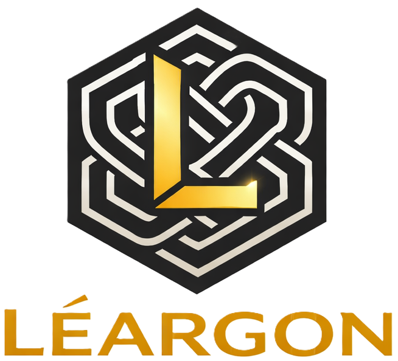

# 🌌 Léargon

> Pronounced /'lʲeːɾˠɡɒn/
> 
> léargas (pronounced: /'lʲeːɾˠɡəsˠ/) is Irish for sight, insight, enlightment or visibility

### *The Architect of Process Clarity & Guardian of Data Ontology*

> "In the darkness of fragmented data, hidden workflows, and covered interfaces, **Léargon** is the light that reveals the whole."

**Léargon** is a powerful open-source tool designed to bring order to the chaos of enterprise landscapes. Like a wise seer, it connects complex **Data** with dynamic **Processes**, and mapping to **Domains**, ensuring seamless governance and absolute transparency across your entire fabric, always with the sight on business.

---

## 🛡️ The Vision

In a world of siloed information, seeing the "Big Picture" is a monumental challenge. **Léargon** was forged to:

*   **Forge Visibility:** Unearth hidden dependencies between business objects and their operational paths.
*   **Establish Structure:** Build an unshakable ontology as the foundation for all corporate logic.

## ✨ Core Powers

*   🔮 **Holistic Mapping:** Visualize the entirety of your business objects in a multi-dimensional view.
*   📜 **Ontology Weaver:** Seamlessly weave data models into your live operational workflows.
*   ⚡ **Process Insight:** Detect bottlenecks and structural fractures before they impact your realm.
*   🏛️ **Immutable Governance:** Define policies as enduring as stone, yet as adaptable as light.

## What Léargon Does

Léargon unifies three analytical frameworks — **Domain-Driven Design (DDD)**, **Business Capability Modelling (BCM)**, and **DSG/GDPR compliance** — into a single data model. The same domains, processes, entities, and teams are viewed through different lenses depending on the analytical goal.

| Feature | Description |
|---|---|
| **Data entity catalogue** | Multilingual ontology of business objects with parent–child hierarchies, ownership, classifications, retention periods, and quality rules |
| **Business process catalogue** | Process hierarchy with BPMN diagrams, input/output entities, executing teams, IT systems, legal basis, purpose, and DPA links |
| **Domain & bounded context map** | Hierarchical business domain model with DDD bounded contexts, context relationships (Partnership, ACL, …), domain events, and a visual context map |
| **Capability map** | Stable "what we can do" tree with owning teams, realising processes, and supporting IT systems |
| **Organisational unit tree** | Internal and external org units with ownership chains; bottleneck and Conway's Law alignment analytics |
| **IT system & service provider registry** | IT systems linked to processes and capabilities; external data processors with DPA checklist |
| **Processing register** | Art. 30 GDPR / Art. 12 revDSG-ready view with cross-border transfer register and CSV export |
| **DPIA tracking** | Risk description, mitigation, residual risk, and completion status per process or entity |
| **Version history** | Full JSON snapshot of every change to entities, domains, and processes |
| **Classification taxonomy** | Flexible, multilingual tag system assignable to any object type; system classifications locked for compliance |
| **Role-based access** | `ROLE_ADMIN` and `ROLE_USER`, plus per-object ownership (data owner, process owner, org unit lead) with computed inheritance |
| **Azure Entra ID** | Optional enterprise SSO via MSAL; local JWT login always available for the fallback admin |
| **Multilingual** | All names and descriptions stored as localised text; UI language switchable per user |

---

## Tech Stack

| Layer | Technology |
|---|---|
| Frontend | React 19, TypeScript 6, Vite 8, Material UI 7, TanStack React Query 5 |
| Backend | Kotlin 2.3, Micronaut 4.10, JVM 21, Hibernate JPA, Micronaut Data |
| Database | MySQL 8.4 with Liquibase migrations |
| Auth | Local JWT (HS256) + Azure Entra ID (RS256 / MSAL) |
| Diagrams | React Flow, Dagre |
| API | OpenAPI 3 definition-first; Orval generates TypeScript client hooks |
| Tests | Spock 2 (backend), Vitest + Testcontainers (integration), Playwright (E2E) |
| CI/CD | GitHub Actions — build, Trivy scan, integration + E2E tests, GHCR publish |

---

## Getting Started

```bash
docker compose up
```

Open http://localhost:3000 and log in with the default admin credentials (`admin@leargon.local` / `ChangeMe123!`).

See [QUICK_START.md](QUICK_START.md) for the full guide, [DEPLOYMENT.md](DEPLOYMENT.md) for production deployment, and [ARCHITECTURE.md](ARCHITECTURE.md) for C4 diagrams.

## Documentation

| File | Contents |
|---|---|
| [QUICK_START.md](QUICK_START.md) | Local setup, first login, navigation overview |
| [DEPLOYMENT.md](DEPLOYMENT.md) | Docker Compose, environment variables, Azure setup, production checklist |
| [ARCHITECTURE.md](ARCHITECTURE.md) | C4 context, container, component, and dynamic diagrams |
| [CONCEPTS.md](CONCEPTS.md) | Domain model, RBAC, deletion behaviour, analytical perspectives |
| [ROADMAP.md](ROADMAP.md) | Prioritised feature backlog with user stories |